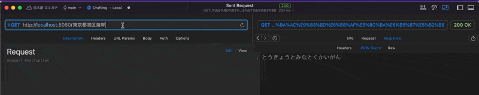

# Welcome to furigana 👋

[](https://twitter.com/ThaddeusJiang)

> 日本語の漢字から「ふりがな」を自動作成



## Get Started

```
mix deps.get

iex -S mix run
```

open http://localhost:8080

## Author

👤 **Thaddeusjiang**

- Website: https://thaddeusjiang.com/
- Twitter: [@ThaddeusJiang](https://twitter.com/ThaddeusJiang)
- Github: [@ThaddeusJiang](https://github.com/ThaddeusJiang)

## Show your support

Give a ⭐️ if this project helped you!

---

_This README was generated with ❤️ by [readme-md-generator](https://github.com/kefranabg/readme-md-generator)_
